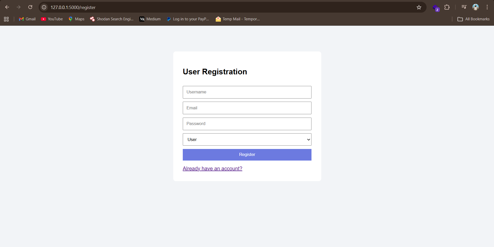
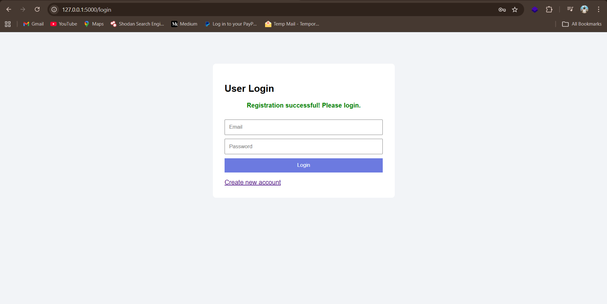
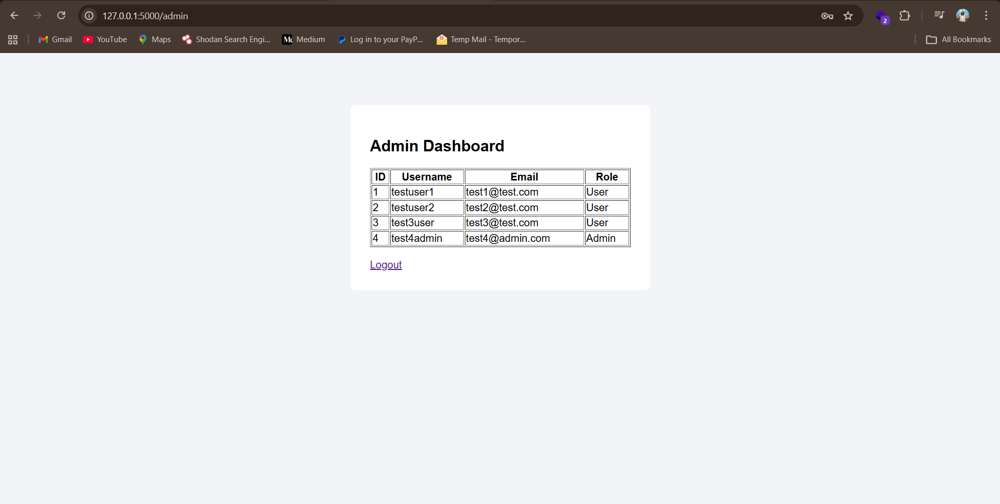
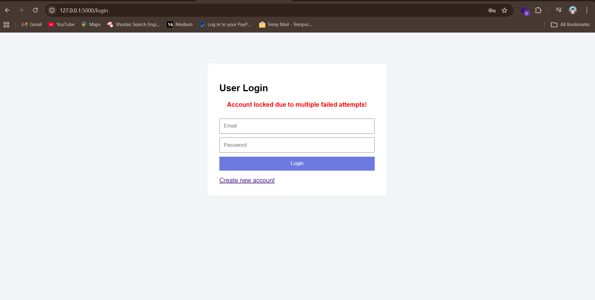
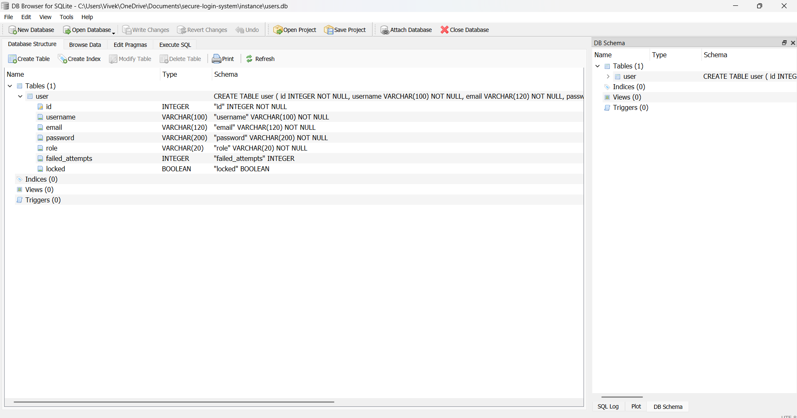

# Secure Login System with Role-Based Access Control

## Project Overview

This project is a secure web-based login system developed as part of my Cyber Security Internship.
It implements authentication, authorization, and multiple security controls to protect against common web attacks.

The system supports User and Admin roles with restricted access and includes protections such as password hashing,
account lockout, input validation, and secure session management.

---

## Technologies Used

Backend: Flask (Python)  
Frontend: HTML, CSS  
Database: SQLite  
Security: bcrypt, Flask sessions  
Tools: VS Code, Git, GitHub  

---

## Setup Instructions

Clone the repository, install dependencies, and run the application.

git clone https://github.com/Vivekkka/secure-login-system.git  
cd secure-login-system  
pip install flask flask-sqlalchemy flask-bcrypt  
python app.py  

Open in browser:  
http://127.0.0.1:5000

---

## Features Implemented

## User Registration
Register using username, email, password, and role  
Duplicate email registration prevented  
Passwords securely hashed using bcrypt  

## User Login
Secure login with email and password  
Session-based authentication  
Role-based redirection after login  

## Role-Based Access Control (RBAC)
Admin can view all registered users  
Users cannot access admin routes  
Unauthorized access is restricted  

---

## Security Enhancements

Input validation to prevent SQL Injection  
Password hashing using bcrypt  
Account lockout after 3 failed login attempts  
Session protection after logout  
Secure database handling  

---

## Testing Performed

Successful user registration  
Duplicate email registration handling  
Invalid login attempt handling  
Account lockout after multiple failed attempts  
Session protection after logout  
Verification of hashed passwords in database  

---

## Screenshots (System in Action)

### VS Code Project Structure

### Registration Page

### Registration Success

### Login Page

### Login Success Redirect

### Admin Dashboard

### Account Lockout

### SQLite Database Structure

---

## Challenges Faced and Solutions

## Duplicate Registration
Problem: Users could register with the same email  
Solution: Implemented unique email validation using database queries  

## Password Security
Problem: Plain-text passwords are insecure  
Solution: Implemented bcrypt password hashing  

## Brute Force Login Attempts
Problem: Unlimited login attempts  
Solution: Implemented failed login counter and account lockout mechanism  

## Unauthorized Access
Problem: Users accessing admin routes  
Solution: Implemented role-based access control using Flask sessions  

---

## Conclusion

This project provided hands-on experience in building a secure authentication system while applying
cybersecurity principles such as secure password storage, access control, brute force prevention,
and session security.

---

## Author

Vivek Kumar Digar  
Cyber Security Intern  
GitHub: https://github.com/Vivekkka
